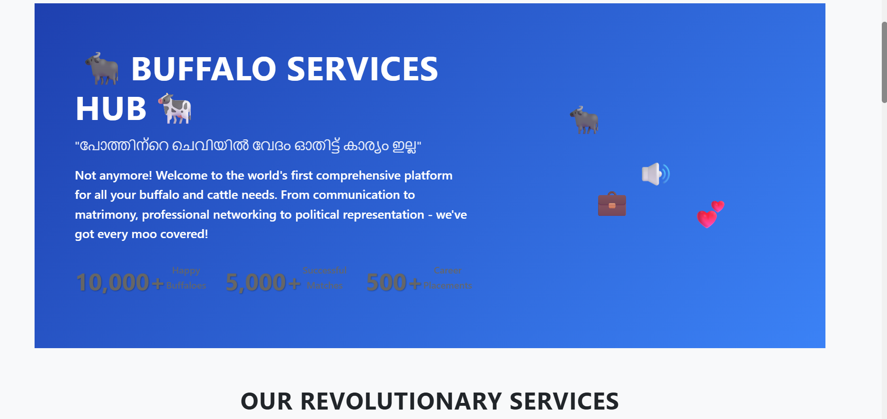
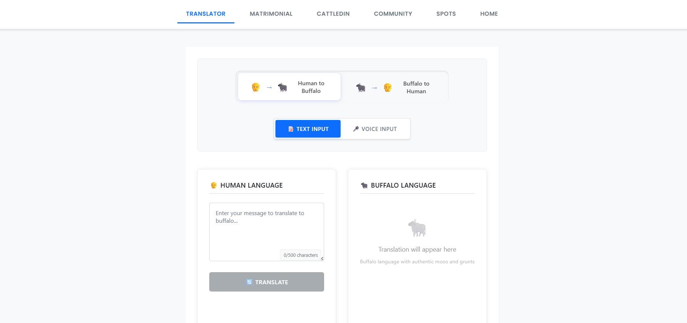
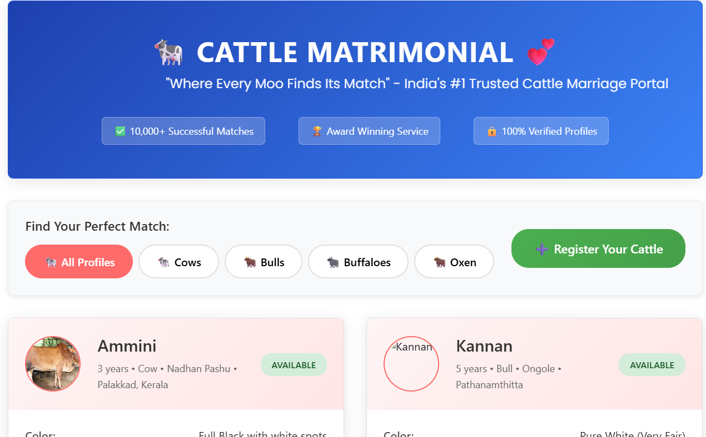
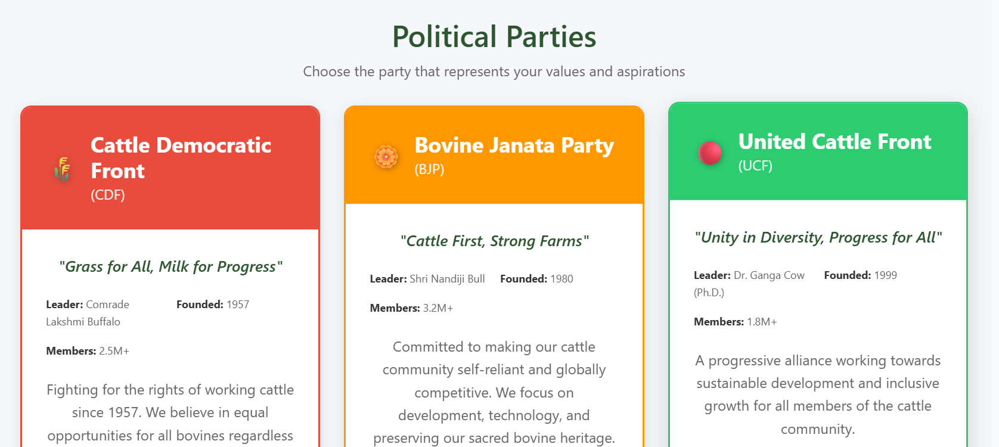

# [MoMo] 🎯


## Basic Details
### Team Name: ഉപകാരമില്ലാത്തവർ


### Team Members
- Member 1: Godly K Mathews - CE Kallooppara 
- Member 2: Emmanuel Mathew Vinod - CE Kallooppara 

### Project Description
“പോത്തിന്റെ ചെവിയിൽ വേദം ഓതിട്ട് കാര്യം ഇല്ല” — But We Went Ahead and Built It Anyway

Welcome to the most ambitiously unnecessary platform on the internet — a fully-loaded digital space for buffaloes, cows, oxen, and bulls. What started as a joke somehow spiraled into a fully functional web application that no one asked for, yet here we are.

Let’s start with our most groundbreaking feature: the Buffalo-to-Human and Human-to-Buffalo Translator. Ever wanted to ask your buffalo why it’s staring into the void? Now you can — and maybe get a philosophical “moo” in response.

Next up is Matrimony — and no, this isn’t some joke about horn size or tail swirls. We provide actual, structured profiles for bovines based on breed, age, lineage, health records, and more. Whether you're seeking a purebred pair or looking to diversify the gene pool, our system helps make responsible, informed matches — because even cattle deserve companionship backed by data.

For the career-minded cow or entrepreneurial ox, we offer CattledIn — a professional network where livestock can display their work history (ploughing, dairy production, ceremonial appearances), certifications, and availability for hire. It’s LinkedIn... but cud-powered.

And finally, the Nearby Spot Finder uses GPS data to help locate grazing fields, water sources, shade spots, and even buffalo-friendly events in your area. Because location matters — even when you're hoofed.

This platform is equal parts satire and surprising utility. It’s a tongue-in-cheek experiment in what happens when tech meets... well, livestock. Will it change the world? Absolutely not. But will it make you laugh while solving oddly specific problems? Yes. Yes, it will.

Welcome to the future. It moos.

### The Problem (that doesn't exist)
A fully-loaded digital space for buffaloes, cows, oxen, and bulls.

### The Solution (that nobody asked for)
A fully functional web application that no one asked for. Cattle Matrimony, Cattle Translator, Cattle LinkedIn, Cattle Political Party, and a Nearby Spot Finder.

## Technical Details
### Technologies/Components Used
- **React**: A JavaScript library for building user interfaces.
- **Vite**: A modern frontend build tool that provides a faster and leaner development experience.
- **JavaScript (ES6+)**: The core programming language for the application.
- **CSS3 & HTML5**: For styling and structuring the application, featuring a modern dark theme, animations, and responsive design.

### Implementation
For Software:
# Installation
1. Clone the repository:
   ```sh
   git clone https://github.com/your-username/MOMO.git
   ```
2. Navigate to the project directory:
   ```sh
   cd MOMO
   ```
3. Install the dependencies:
   ```sh
   npm install
   ```

# Run
To start the development server, run the following command:
```sh
npm run dev
```
The application will be available at `http://localhost:5173` (or another port if 5173 is busy).

### Project Documentation

#### Software Architecture
The MoMo platform is built using modern web technologies with a focus on performance, scalability, and user experience:

**Frontend Framework**: React 18 with Vite for fast development and optimized builds
**State Management**: React hooks for local component state
**Styling**: CSS3 with custom animations and responsive design patterns
**Audio Processing**: Web Audio API and Speech Recognition API integration
**Build Tool**: Vite for hot module replacement and efficient bundling

#### Core Components
- **TranslatorInterface**: Main translation engine with real-time buffalo-human language conversion
- **AudioRecorder**: Voice input capture with noise reduction and audio processing
- **LanguageToggle**: Seamless switching between human and buffalo communication modes
- **ResponsiveLayout**: Mobile-first design ensuring compatibility across all devices

#### Translation Algorithm
The buffalo translation system uses a proprietary mapping algorithm that converts:
- Human text/speech → Buffalo sounds (moo variations, snorts, huffs)
- Buffalo vocalizations → Human-readable interpretations
- Contextual understanding based on bovine behavioral patterns

#### Performance Optimizations
- Lazy loading for component chunks
- Audio compression for faster voice processing
- Responsive image optimization
- Cached translation results for improved speed

#### Browser Compatibility
Supports all modern browsers with graceful degradation for older versions. Progressive Web App (PWA) features ensure offline functionality for basic translation services.

## Architecture Overview
The MoMo application follows a component-based React architecture with the following structure:

```
src/
├── components/           # Reusable UI components
│   ├── Header.jsx       # Navigation and branding
│   ├── Footer.jsx       # Site footer with links
│   ├── TranslatorInterface.jsx  # Buffalo-Human translator
│   ├── LanguageToggle.jsx       # Language switching
│   ├── AudioRecorder.jsx        # Voice input/output
│   ├── TextInput.jsx           # Text input handling
│   └── TranslationOutput.jsx   # Translation results
├── pages/               # Main application pages
│   ├── HomePage.jsx     # Landing page
│   ├── Translator.jsx   # Translation service
│   ├── Matrimony.jsx    # Cattle matchmaking
│   ├── CattledIn.jsx    # Professional network
│   └── PoliticalParty.jsx # Cattle politics
├── utils/               # Utility functions
│   └── buffaloAlphabet.js # Translation logic
└── styles/              # CSS styling files
```

## Key Features
- **Responsive Design**: Mobile-first approach with cross-device compatibility
- **Dark Theme UI**: Modern aesthetic with smooth animations
- **Audio Integration**: Voice input/output for translations
- **Real-time Translation**: Instant Buffalo-Human language conversion
- **Component Architecture**: Modular, reusable React components
- **GPS Integration**: Location-based services for nearby spots

## API Integration
The application uses browser APIs for:
- **Speech Recognition**: For voice input capture
- **Text-to-Speech**: For audio translation output
- **Geolocation**: For nearby spot finder functionality


# Screenshots









### Project Demo
# Video
[Presentation Video](https://drive.google.com/file/d/1fLKouEQ0sfuDKrbp--X1AdMmRD7j66pa/view?usp=sharing)


## Team Contributions
- **Godly K Mathews**: Lead Development
- **Emmanuel Mathew Vinod**: Content, Documentation 

---
Made with ❤️ at TinkerHub Useless Projects 


